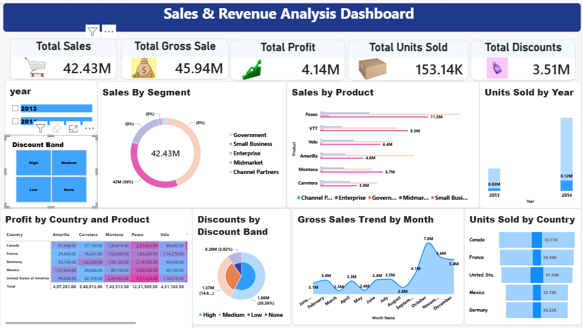

# Sales & Revenue Analysis Dashboard

## Internship Task

This project was completed as part of an internship task at Thiranex.

## About the Project

This project is a Sales and Revenue Analysis Dashboard created using Power BI Desktop.

The dashboard provides an interactive view of sales performance, revenue, profit, units sold and discounts.

## Dataset

Microsoft Power BI Financial Sample dataset was used for this project.

## Key Features

- Total Sales KPI
- Total Gross Sales KPI
- Total Profit KPI
- Total Units Sold KPI
- Total Discounts KPI
- Sales by Segment
- Sales by Product and Segment
- Profit by Country and Product
- Units Sold by Year
- Discounts by Discount Band
- Gross Sales Trend by Month
- Units Sold by Country
- Year and Discount Band filters

## Tools Used

- Power BI Desktop
- Microsoft Excel Financial Sample Dataset

## Dashboard Preview

## Project Purpose

This project was created as part of learning and internship preparation for data visualization and business analysis using Power BI.
